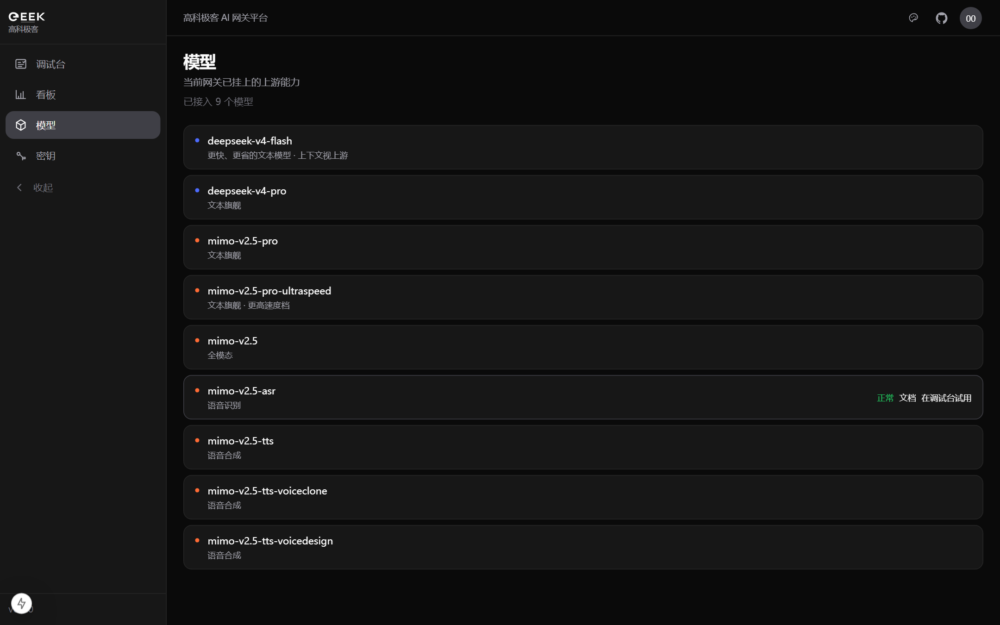
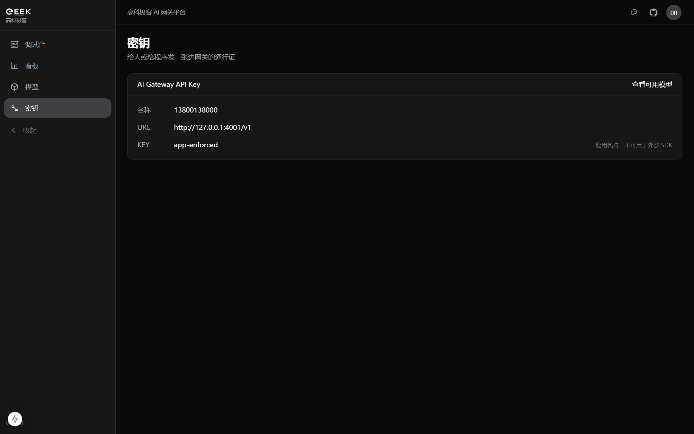
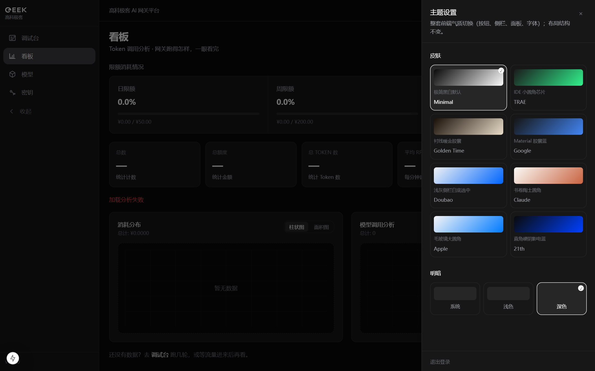

<p align="center">
  
</p>

<h1 align="center">高科极客 AI 网关平台</h1>

<p align="center">
  <b>有趣的人，在这里调用世界</b>
</p>

<p align="center">
  OpenAI 兼容的团队 AI 网关 · Next.js 控制台 · LiteLLM Proxy<br/>
  统一接入 DeepSeek / 小米 MiMo · Virtual Key · 用量观测 · 调试台 · 多皮肤
</p>

<p align="center">
  <a href="https://github.com/htt-FAK/Geek-AI-Gateway-Platform"></a>
  
  
  
</p>

<p align="center">
  <a href="#why">为什么做</a> ·
  <a href="#gallery">界面一览</a> ·
  <a href="#features">功能</a> ·
  <a href="#quickstart">快速开始</a> ·
  <a href="#models">模型</a> ·
  <a href="#architecture">架构</a> ·
  <a href="#docs">文档</a>
</p>

---

<p align="center">
  
</p>

## Why

团队里每个人、每个脚本都去申请上游 Key，最后账单散落、配额失控、排障困难。

**高科极客 AI 网关** 把「接入 → 鉴权 → 计费 → 观测 → 试用」收成一条链路：

| 以前 | 现在 |
|------|------|
| 每人一把上游 Key | 统一 Virtual Key，可轮换、可禁用 |
| 不知道谁在烧钱 | 日 / 月预算 + Token 用量看板 |
| curl 试模型靠猜 | 调试台流式对话 + 模型文档弹层 |
| 控制台长得像后台模板 | 8 套皮肤，进入页品牌钉死 |

本仓库是**精简业务仓**（`gateway/` + `web/` + `deploy/`），**不包含** LiteLLM monorepo 源码。

---

## Gallery

### 用量看板

Token 调用一眼看完：限额进度、消耗分布、调用趋势。

<p align="center">
  
</p>

### 调试台

流式对话、思考深度档位（按模型）、上传上下文、「查看代码」一键复制网关调用示例。

<p align="center">
  
</p>

### 模型目录

每个模型可打开 **文档**：官方说明 + 经本网关的 cURL / Python 示例。

<p align="center">
  
</p>

### 密钥中心

Virtual Key 星号展示、复制、轮换；Base URL 与模型清单一目了然。

<p align="center">
  
</p>

### 主题皮肤

Minimal · TRAE · Golden Time · Google · Doubao · Claude · Apple · 21th  
进入页（`/`、`/login`）**不随皮肤漂移**。

<p align="center">
  
</p>

---

## Features

- **统一网关** — OpenAI 兼容 `/v1`；DeepSeek / MiMo 多别名；峰时计费策略可配
- **控制台** — 手机号登录、会话、日周月预算、用量曲线、管理端用户导入 / 重置
- **调试台** — 流式输出、思考深度、附件上下文、调用示例
- **模型文档** — 站内说明 + 官方外链 + 可复制示例
- **多皮肤** — 侧栏 / 按钮 / Composer / 字体整套气质切换；几何尺寸统一
- **一键运维** — Docker Compose + `scripts/deploy.sh` / `test.sh`

| 入口 | 地址 |
|------|------|
| Web 控制台 | `http://<host>:3000` |
| Gateway API | `http://<host>:4000/v1`（`Authorization: Bearer <Virtual Key>`） |

---

## Quickstart

### 本机开发（Windows）

<details>
<summary><b>1. 启动网关</b></summary>

```powershell
cd gateway
copy .env.example .env   # 填入 DEEPSEEK_API_KEY / MIMO_API_KEY
# 有 Docker：docker compose up -d
# 无 Docker：
#   pip install "litellm[proxy]==1.83.14"
#   $env:PYTHONPATH = (Get-Location).Path
#   litellm --config ./config.yaml --port 4000 --host 0.0.0.0
```

</details>

<details>
<summary><b>2. 启动 Web</b></summary>

```powershell
cd web
copy .env.example .env
# GATEWAY_BASE_URL=http://127.0.0.1:4000  （不要带 /v1）
# LITELLM_MASTER_KEY 与 gateway 一致
npm install
npx prisma migrate deploy
npm run dev
```

打开 [http://localhost:3000/login](http://localhost:3000/login)。

</details>

<details>
<summary><b>3. 验收（可选）</b></summary>

```powershell
cd web
$env:REQUIRE_VIRTUAL_KEY = "true"   # 有 Postgres + VK 时；否则 "false"
npm run test:server
```

</details>

### 服务器一键部署（Linux + Docker）

```bash
chmod +x scripts/*.sh deploy/web-entrypoint.sh
./scripts/env-init.sh
# 编辑 deploy/.env：填入真实上游 Key
./scripts/deploy.sh
./scripts/test.sh          # 期望 SERVER_E2E_OK
```

> `test.sh` 会临时打开 `ALLOW_TEST_HOOKS`，结束后自动恢复。

---

## Models

| Provider | Model ID | 说明 |
|----------|----------|------|
| DeepSeek | `deepseek-v4-flash` | 更快更省 |
| DeepSeek | `deepseek-v4-pro` | 旗舰 · 思考档 |
| MiMo | `mimo-v2.5-pro` | 文本旗舰 |
| MiMo | `mimo-v2.5-pro-ultraspeed` | 高速档 |
| MiMo | `mimo-v2.5` | 全模态 |
| MiMo | `mimo-v2.5-asr` / `*-tts*` | 语音识别 / 合成 |

```bash
curl "$GATEWAY/v1/chat/completions" \
  -H "Authorization: Bearer $AI_GATEWAY_API_KEY" \
  -H "Content-Type: application/json" \
  -d '{
    "model": "deepseek-v4-flash",
    "messages": [{"role": "user", "content": "Hello"}]
  }'
```

控制台 **模型 → 文档** 可查看每个模型的完整示例与官方说明。

---

## Architecture

```text
┌──────────────┐   cookie session   ┌─────────────────┐
│   Browser    │ ─────────────────► │  Next.js Web    │
│   控制台 UI  │                    │  BFF + Prisma   │
└──────────────┘                    └────────┬────────┘
                                             │ Master Key / proxy
                                             ▼
                                    ┌─────────────────┐
                                    │  LiteLLM Proxy  │
                                    │  :4000  /v1     │
                                    └────────┬────────┘
                         ┌───────────────────┴───────────────────┐
                         ▼                                       ▼
                   DeepSeek API                             MiMo API
```

```text
ai-gateway-platform/
├── deploy/       # Compose · Web 镜像 · entrypoint
├── gateway/      # LiteLLM 配置 · 峰谷价 · model_catalog
├── web/          # 控制台 + BFF
├── scripts/      # env-init · deploy · test
├── docs/         # 交接文档 · README 截图
└── openspec/     # 变更规格
```

- 用户持 **Virtual Key**，经网关限流与计费  
- Web 用 Master Key 做管理面（建用户、重发 Key、Spend）  
- 看板聚合业务库事件 + 网关 Spend

---

## Docs

| 文档 | 路径 |
|------|------|
| 实现交接 | [`docs/实现交接-手机号登录与网关.md`](docs/实现交接-手机号登录与网关.md) |
| 开发文档 | [`AI网关平台-开发文档.md`](AI网关平台-开发文档.md) |
| 前端设计规范 | [`AI网关平台-前端设计规范.md`](AI网关平台-前端设计规范.md) |
| Web | [`web/README.md`](web/README.md) |
| 截图资源 | [`docs/images/`](docs/images/) |

环境模板：[`gateway/.env.example`](gateway/.env.example) · [`web/.env.example`](web/.env.example) · [`deploy/.env.example`](deploy/.env.example)

---

## Security

- 切勿把真实上游 Key、Master Key、用户 Virtual Key 提交进 Git  
- 只提交 `*.env.example`；生产使用 `deploy/.env` / `web/.env`  
- 若仓库曾公开过密钥，请立即轮换

---

## License

内部业务项目。未声明开源协议前，请勿擅自公开发布或二次分发敏感配置。

---

<p align="center">
  <sub>Geek · 高科极客工作室 · Interesting people. Calling the world from here.</sub>
</p>
