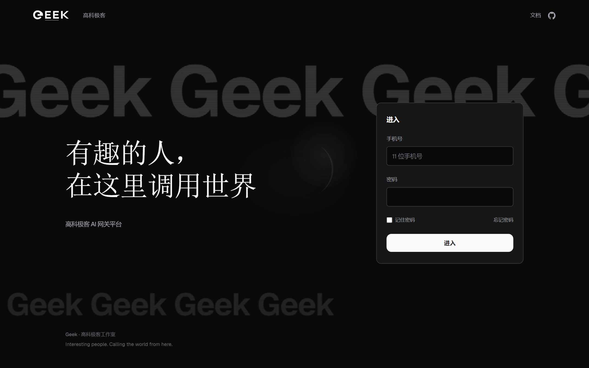
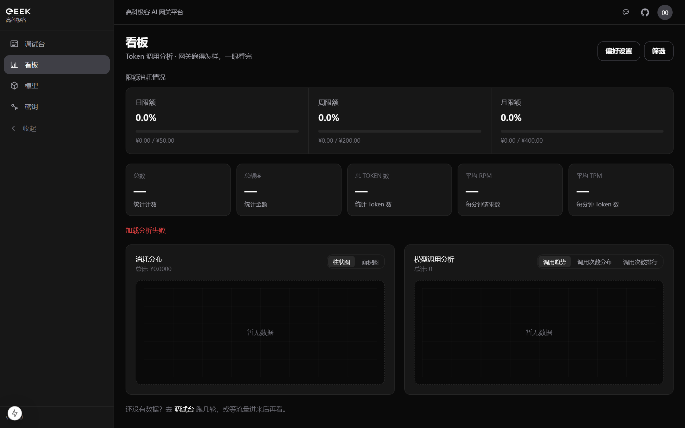
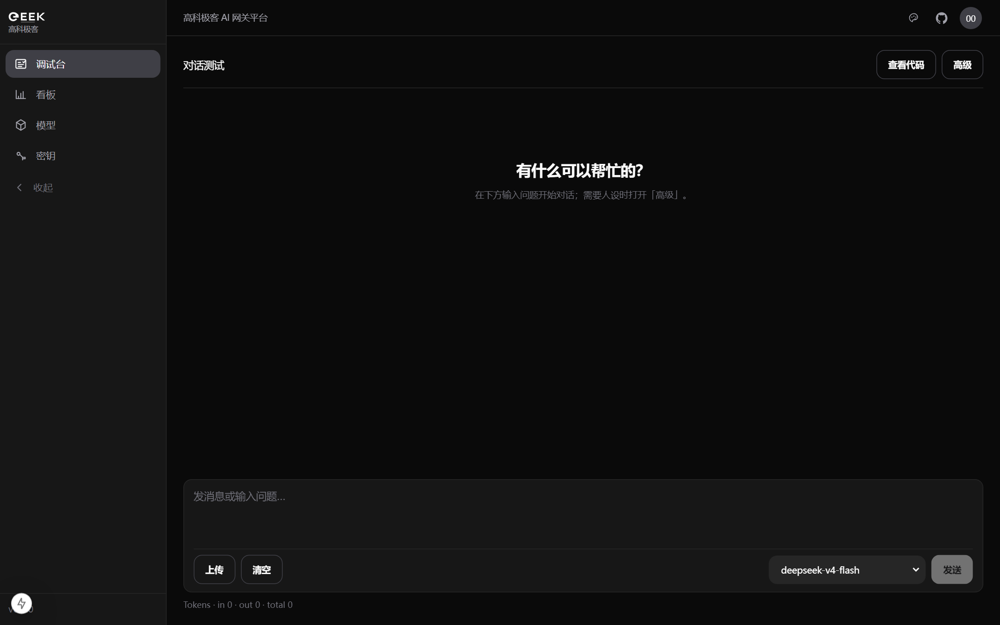
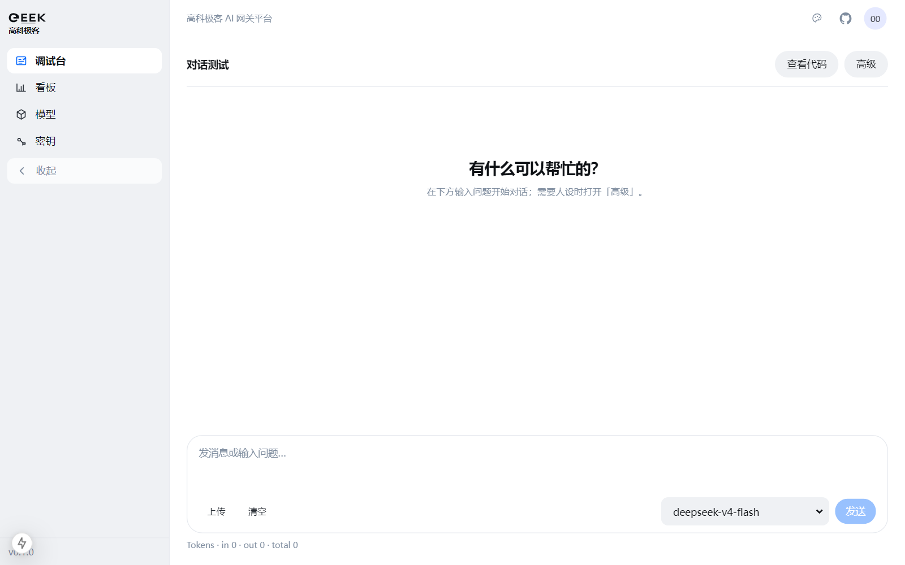
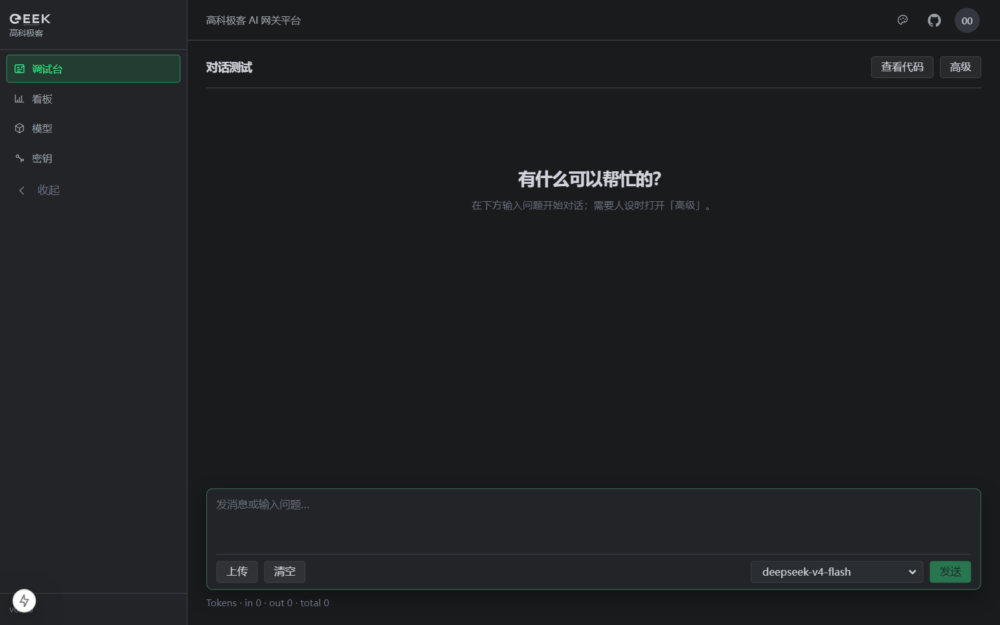
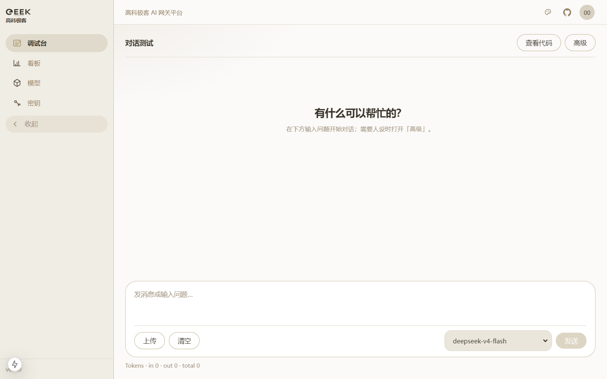
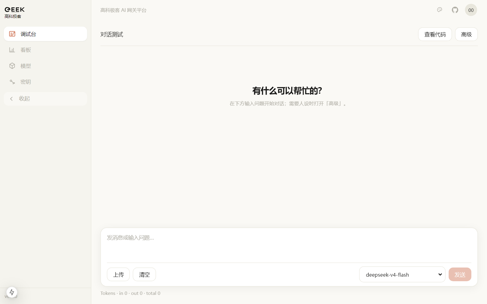
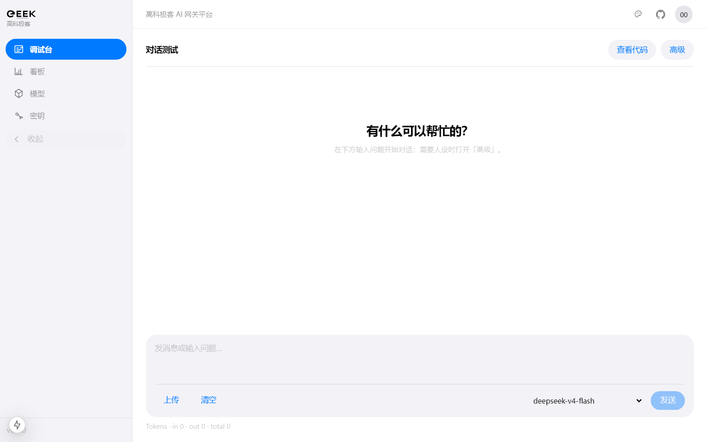
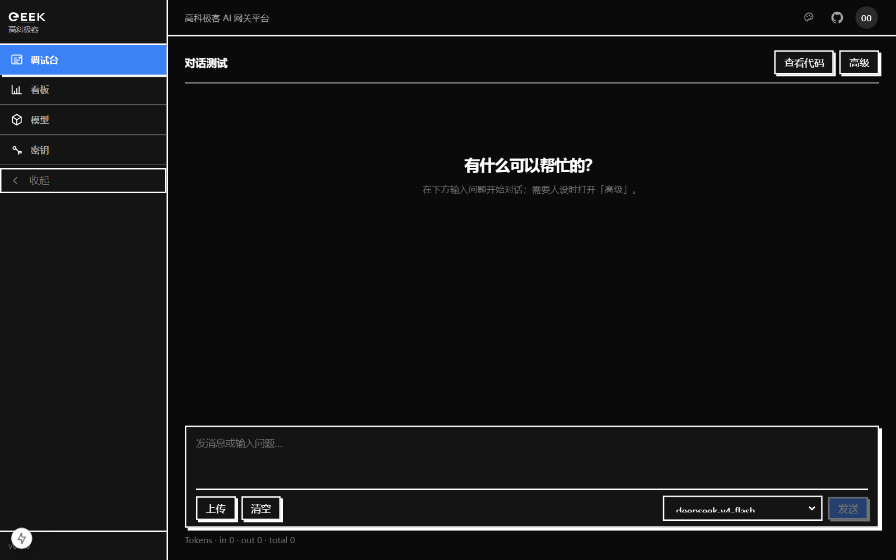

<p align="center">
  
</p>

<h1 align="center">高科极客 AI 网关平台</h1>

<p align="center"><b>有趣的人，在这里调用世界</b></p>

<p align="center">
  OpenAI 兼容的团队 AI 网关<br/>
  统一接入 · Virtual Key · 用量观测 · 调试台 · <b>8 套皮肤</b>
</p>

<p align="center">
  <a href="https://github.com/htt-FAK/Geek-AI-Gateway-Platform"></a>
  &nbsp;
  
  &nbsp;
  
</p>

<p align="center">
  <a href="#product">产品</a> ·
  <a href="#skins">多皮肤</a> ·
  <a href="#features">功能</a> ·
  <a href="#quickstart">快速开始</a> ·
  <a href="#models">模型</a> ·
  <a href="#architecture">架构</a>
</p>

---

## Product

把「接入 → 鉴权 → 计费 → 观测 → 试用」收成一条链路：每人一把 Virtual Key，看板看用量，调试台试模型，模型页直接看调用文档。

<p align="center">
  <br/>
  <sub>进入页 · 品牌钉死，不随皮肤漂移</sub>
</p>

<br/>

<p align="center">
  <br/>
  <sub>用量看板 · 日 / 周 / 月限额与 Token 趋势</sub>
</p>

<br/>

<p align="center">
  <br/>
  <sub>调试台 · 流式对话、思考深度、调用示例</sub>
</p>

<div align="center">

| 以前 | 现在 |
|:----:|:----:|
| 每人一把上游 Key | 统一 Virtual Key，可轮换、可禁用 |
| 不知道谁在烧钱 | 日 / 月预算 + Token 看板 |
| curl 试模型靠猜 | 调试台 + 模型文档弹层 |
| 控制台千篇一律 | **8 套皮肤**，气质一眼可辨 |

</div>

---

## Skins

控制台支持 8 套深度定制皮肤（侧栏 / 按钮 / Composer / 字体整套切换）。进入页始终保持品牌样式。

<p align="center">
  
  &nbsp;
  
</p>
<p align="center">
  <sub>Doubao（浅）&nbsp;&nbsp;·&nbsp;&nbsp;TRAE（深）</sub>
</p>

<p align="center">
  
  &nbsp;
  
</p>
<p align="center">
  <sub>Golden Time&nbsp;&nbsp;·&nbsp;&nbsp;Claude</sub>
</p>

<p align="center">
  
  &nbsp;
  
</p>
<p align="center">
  <sub>Apple&nbsp;&nbsp;·&nbsp;&nbsp;21th</sub>
</p>

<div align="center">

| 皮肤 | 气质 |
|:----:|:----:|
| Minimal | 极简黑白默认 |
| TRAE | IDE 小圆角 · 青绿 / 浅紫 |
| Golden Time | 暖纸衬线 · 金色胶囊 |
| Google | Material · 蓝 pill |
| Doubao | 浅灰侧栏 · 白底选中 |
| Claude | 纸感 · 陶土圆角 |
| Apple | 毛玻璃 · System Blue |
| 21th | 直角硬阴影 · 电蓝 |

</div>

---

## Features

- **统一网关** — OpenAI 兼容 `/v1`；DeepSeek / MiMo；峰时计费可配  
- **控制台** — 手机号登录、预算、用量曲线、密钥轮换、模型文档  
- **调试台** — 流式输出、思考深度、附件、cURL / SDK 示例  
- **多皮肤** — 8 套整站气质；侧栏几何统一；进入页品牌钉死  
- **一键运维** — `deploy/` Compose + `scripts/deploy.sh` / `test.sh`

<div align="center">

| 入口 | 地址 |
|:----:|:----:|
| Web | `http://<host>:3000` |
| API | `http://<host>:4000/v1` |

</div>

---

## Quickstart

<details>
<summary><b>本机开发（Windows）</b></summary>

```powershell
# 网关
cd gateway
copy .env.example .env   # 填入上游 Key
# docker compose up -d   或 litellm --config ./config.yaml --port 4000

# Web
cd ../web
copy .env.example .env   # GATEWAY_BASE_URL=http://127.0.0.1:4000（无 /v1）
npm install
npx prisma migrate deploy
npm run dev
```

打开 http://localhost:3000/login

</details>

<details>
<summary><b>服务器一键部署（Linux + Docker）</b></summary>

```bash
chmod +x scripts/*.sh deploy/web-entrypoint.sh
./scripts/env-init.sh
# 编辑 deploy/.env
./scripts/deploy.sh && ./scripts/test.sh
```

</details>

---

## Models

<div align="center">

| Provider | Model | 说明 |
|:--------:|:-----:|:----:|
| DeepSeek | `deepseek-v4-flash` | 更快更省 |
| DeepSeek | `deepseek-v4-pro` | 旗舰 · 思考档 |
| MiMo | `mimo-v2.5-pro` | 文本旗舰 |
| MiMo | `mimo-v2.5-pro-ultraspeed` | 高速档 |
| MiMo | `mimo-v2.5` | 全模态 |
| MiMo | `mimo-v2.5-asr` / `*-tts*` | 语音 |

</div>

```bash
curl "$GATEWAY/v1/chat/completions" \
  -H "Authorization: Bearer $AI_GATEWAY_API_KEY" \
  -H "Content-Type: application/json" \
  -d '{"model":"deepseek-v4-flash","messages":[{"role":"user","content":"Hello"}]}'
```

控制台 **模型 → 文档** 可查看每个模型的官方说明与完整示例。

---

## Architecture

```text
Browser ──session──► Next.js Web (BFF)
                          │
                          ▼
                    LiteLLM Proxy :4000/v1
                     ┌────┴────┐
                DeepSeek     MiMo
```

```text
deploy/   Compose · Web 镜像
gateway/  LiteLLM · 峰谷价 · catalog
web/      控制台 + BFF
scripts/  env-init · deploy · test
docs/     交接 · README 截图
```

本仓库是精简业务仓，**不含** LiteLLM monorepo 源码（镜像 `v1.83.14-stable`）。

---

## Docs & Security

<div align="center">

| 文档 | 路径 |
|:----:|:----:|
| 交接 | [`docs/实现交接-手机号登录与网关.md`](docs/实现交接-手机号登录与网关.md) |
| 开发 | [`AI网关平台-开发文档.md`](AI网关平台-开发文档.md) |
| 截图 | [`docs/images/`](docs/images/) |

</div>

- 切勿提交真实 Key；只用 `*.env.example`  
- 内部项目，未声明开源协议前请勿擅自分发敏感配置

---

<p align="center">
  <sub>Geek · 高科极客工作室 · Interesting people. Calling the world from here.</sub>
</p>
